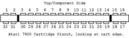

# Lokey 7800 YM

## **WARNING**

> **WORK IN PROGRESS / ALPHA STATE**\
> This laboratory is an active research project. The hardware has unstable feedback; it is sort of working but needs to be perfected. The codebase, wiring diagrams, and tools are subject to frequent breaking changes as we optimize for a "Gold Standard" release. Proceed with curiosity and caution!


This repository is a playground for experiments with the Atari 7800 using YM2149 on cartridge.

## Why this project?

The goal is to provide a stable, low-cost ($~2 USD) bridge between the Atari 7800 and the Atari ST. By leveraging the YM2149 PSG—or modern clones like the **KC89C72** (used in this project's lab) which are still in production—we can bring rich, standardized three-channel sound to the 7800 with 100% Atari ST asset compatibility. Original YM2149s remain widely available as used or New-Old-Stock (NOS) at similar price points.

## Build

By default, sources build with the 128-byte A78 header (good for emulators):

```bash
make a78
```

To build raw ROM images (no A78 header, good for EPROM burning), set
`build_with_header=0`:

```bash
make bin
```

## Emulator Support

Before testing on real hardware, you can verify your builds using a specialized branch of the **a7800** emulator that supports this physical YM2149 mapping:

- **Repository**: [https://github.com/jbsohn/a7800](https://github.com/jbsohn/a7800)
- **Branch**: `ym2149`

### Compatibility Notes

- **Modern Hardware**: This branch includes specific updates for **macOS on Apple Silicon (M1/M2/M3)**.
- **C# / .NET Tooling**: All diagnostic and processing tools require the **.NET SDK** (verified on Linux and macOS).
- **Supported Platforms**: Built and tested for **macOS** and **Linux**.
- **Windows**: Currently **untested**. If you are on Windows, your mileage may vary as the build environment has not been verified for that platform yet.

This is the recommended way to iterate on your code and musical assets before committing to a hardware burn.

## Signing for Real 7800 Hardware

Atari 7800 cartridges must be cryptographically signed. After building a raw
`.bin`, run `7800sign -w` to write the signature into the ROM image:

```bash
7800sign -w ym2149_heartbeat_main.bin
7800sign -t ym2149_heartbeat_main.bin
7800sign -w ym2149_melody_vbi.bin
7800sign -t ym2149_melody_vbi.bin
```

Important ROM footer requirement for `7800sign`:

- `$FFF8` must be `$FF`
- `$FFF9` low nibble must be `3` or `7` (for a 32KB image at `$8000`, use `$83`)

In assembly source:

```asm
org $fff8
.byte $ff
.byte $83
org $fffa
.word reset
.word reset
.word reset
```

## Output Formats

- `.a78`: 128-byte A78 header + 32 KB ROM (`32896` bytes total). Use for emulators.
- `.bin`: raw 32 KB ROM only (`32768` bytes). Use for EPROM programming / real cartridge testing.

For real hardware, start with **ym2149_heartbeat_main.bin**. It is our "Gold Standard" baseline that has been verified 100% stable on the Atari 7800.

## Memory Mapping & POKEY Compatibility

The YM2149 sound card in this lab is mapped to the **$4000–$7FFF** range (16 KB).

### Write-Only Mirroring (Theoretical)

The current GAL logic is gated by the `!RW` (Read/Write) line. This means the YM2149 should effectively be a "write-only" device at $4000. In theory, this allows other devices (like ROM or RAM) to reside at the same memory addresses for **read** operations without bus contention.

> **NOTE:** This "Stealth Mirroring" is the intended design but remains untested on live hardware. It represents one of our "hopes" for maximum bus efficiency!

This mapping is intentional: it follows the historical precedent set by classic Atari 7800 games like **Ballblazer** and **Commando**, which mapped the **POKEY** sound chip to $4000. By mirroring this 16k "Sound Area," we ensure high compatibility with existing hardware designs and make it easier for 7800 developers to swap or supplement POKEY with the YM2149.

## PCB Design Workflow (SKiDL)

Unlike traditional hardware projects, this laboratory uses a **Code-to-PCB** workflow. The "Source of Truth" for the schematic is not a visual diagram, but the Python source code found in `pcb/main.py`.

We leverage **SKiDL**, a Python library that allows us to define electronic connections programmatically. This ensures that our hardware logic is version-controllable, modular, and precisely mapped to the Atari 7800's technical specifications.

### Hardware Status: "Gold Standard"

The current design includes:

- **Full YM2149 / AY-3-8910 Support**: Integrated via a 74HCT373 latch.
- **A78 Maxi Connector**: A precise 32-pin physical layout that accounts for the 7800's alignment notches.
- **Professional Constraints**: Baked-in design rules (0.25mm traces, 0.8mm vias) sourced from the [Otaku-flash](https://github.com/karrika/Otaku-flash) project.
- **Socket-Ready**: All ICs use standard DIP through-hole footprints.

### Environment Setup

The PCB project requires local environment variables to point to your KiCad library locations. 

1. **Setup `.env`**: Copy the example template and adjust the paths to match your system (macOS defaults are provided):
   ```bash
   cp pcb/env.example pcb/.env
   ```
2. **Install Dependencies**: The build system will automatically create a virtual environment and install `skidl` and `python-dotenv` on the first run of `make pcb`. You can also trigger this manually:
   ```bash
   make -C pcb install
   ```

### Build Instructions

To generate the latest PCB assets (Netlist and visual SVG), ensure you have the dependencies installed in the `pcb/venv` and run:

```bash
make pcb
```

This will produce:

- `pcb/main.net`: The authoritative netlist for import into KiCad.
- `pcb/main.svg`: A visual block-diagram review of the connections.

### Importing into KiCad

1. Open KiCad and select **Open Project**.
2. Open `pcb/7800-ym.kicad_pro`.
3. Open the **PCB Editor**.
4. Go to **File -> Import -> Netlist...** and select `pcb/main.net`.

## GAL Logic

This project provides two `GAL16V8` programming files for address decoding:

1. **[rom.pld](gal/rom.pld)**: A simple 32KB ROM decoder. It removes the need for basic LS04/LS02 logic chips and is intended for initial hardware testing before adding the sound chip.
2. **[rom_ym.pld](gal/rom_ym.pld)**: The full decoder. It includes the 32KB ROM decoding plus the logic required to map the YM2149 sound chip to the $4000-$7FFF address space, along with its clock and bus controls.

## Hardware Wiring

To connect a **YM2149** (or **AY-3-8910**) to the Atari 7800 using the provided `rom_ym.pld` logic:

### 1. GAL16V8 Pinout (`rom_ym.pld`)

| Pin | Signal | Source |
| :--- | :--- | :--- |
| 2 | A15 | 7800 Address Bus |
| 3 | A14 | 7800 Address Bus |
| 4 | A0 | 7800 Address Bus |
| 5 | HALT | 7800 Maria Halt Signal |
| 6 | R/W | 7800 CPU R/W Line |
| 7 | PHI2 | 7800 CPU Clock (Pin 28 on Cart) |
| 15 | **YM_LE** | Latch Enable output to 74HCT373 Pin 11 |
| 16 | **PHI2OUT** | Buffered Clock to YM Pin 22 |
| 17 | **BC1** | Connect to YM Pin 29 |
| 18 | **BDIR** | Connect to YM Pin 27 |
| 19 | **!ROM_CE** | Connect to 27C256 ROM Pin 20 (~CE) |
| 20 | VCC | +5V |

### 2. 74HCT373 Octal Latch Connections

| Latch Pin | Signal | Connection | 27C256 ROM Pin |
| :--- | :--- | :--- | :--- |
| 1 | ~OE | Ground (Always Enable) or GAL Output | - |
| 2 | Q0 | YM Pin 37 (DA0) | - |
| 3 | D0 | 7800 Data Bus D0 | Pin 11 (O0) |
| 4 | D1 | 7800 Data Bus D1 | Pin 12 (O1) |
| 5 | Q1 | YM Pin 36 (DA1) | - |
| 6 | Q2 | YM Pin 35 (DA2) | - |
| 7 | D2 | 7800 Data Bus D2 | Pin 13 (O2) |
| 8 | D3 | 7800 Data Bus D3 | Pin 15 (O3) |
| 9 | Q3 | YM Pin 34 (DA3) | - |
| 10 | GND | Ground | - |
| 11 | LE | Latch Enable (from GAL Pin 15 **YM_LE**) | - |
| 12 | Q4 | YM Pin 33 (DA4) | - |
| 13 | D4 | 7800 Data Bus D4 | Pin 16 (O4) |
| 14 | D5 | 7800 Data Bus D5 | Pin 17 (O5) |
| 15 | Q5 | YM Pin 32 (DA5) | - |
| 16 | Q6 | YM Pin 31 (DA6) | - |
| 17 | D6 | 7800 Data Bus D6 | Pin 18 (O6) |
| 18 | D7 | 7800 Data Bus D7 | Pin 19 (O7) |
| 19 | Q7 | YM Pin 30 (DA7) | - |
| 20 | VCC | +5V | - |

### 3. YM2149 / AY-3-8910 Connections

| YM Pin | Signal | Connection |
| :--- | :--- | :--- |
| 1 | GND | Ground |
| 22 | CLOCK | **PHI2OUT (GAL Pin 16)** |
| 23 | /RESET | +5V |
| 24 | /A9 | GND |
| 25 | A8 | +5V |
| 27 | BDIR | GAL Pin 18 |
| 28 | BC2 | +5V |
| 29 | BC1 | GAL Pin 17 |
| 30 | DA7 | 74HCT373 Q7 (Pin 19) |
| 31 | DA6 | 74HCT373 Q6 (Pin 16) |
| 32 | DA5 | 74HCT373 Q5 (Pin 15) |
| 33 | DA4 | 74HCT373 Q4 (Pin 12) |
| 34 | DA3 | 74HCT373 Q3 (Pin 9) |
| 35 | DA2 | 74HCT373 Q2 (Pin 6) |
| 36 | DA1 | 74HCT373 Q1 (Pin 5) |
| 37 | DA0 | 74HCT373 Q0 (Pin 2) |

1. **Clocking**: Pin 22 (CLOCK) typically receives PHI2OUT from the GAL (1.79MHz) for 1:1 emulator parity. However, the logic is robust enough to support an external 2MHz crystal directly; this provides exact Atari ST sound compatibility for imported assets without needing software frequency adjustments.

## Included Tools

### `tools/ValidateCartSignals.cs`

A diagnostic C# script used to validate the raw physical signals coming off the Atari 7800 cartridge edge connector before they reach the ROM or YM2149.

- **Requirements**: `sigrok-cli` and `dotnet-script` installed globally.
- **Usage**: Run `./tools/ValidateCartSignals.cs` from the project root. It captures 100,000 samples at 24MHz using a logic analyzer (defaults to `fx2lafw`).
- **Output**: Analyzes the CSV stream in real-time and reports the total number of low-to-high transitions for the `PHI2` Clock, `R/W`, `HALT`, and `A15` pins. This proves your physical solder joints and edge-connector logic are completely clean.

## Baseline ROM: `ym2149_heartbeat_main.asm`

This is our "Gold Standard" baseline. It verified that:

1. **Pitch**: Matches the emulator.
2. **Stability**: No notes are dropped (Uses Quad-Tap writes).
3. **Cleanliness**: No stuttering (HALT pulses protect the bus).

**Tempo**: 1.0 seconds per note (Ideal for hardware verification).

### Hardware Tests in Action

Check out the current state of tests running on the dev board:

[](https://www.youtube.com/shorts/xwr_qn-GMdQ)

[](https://www.youtube.com/shorts/qCsVi0Iiq5I)

## Acknowledgements & Credits

- **Karri Kaksonen (karrika)**: For the excellent [Otaku-flash](https://github.com/karrika/Otaku-flash) project. We have integrated the "Gold Standard" Atari 7800 cartridge footprints, symbols, and professional design rules from this MIT-licensed repository.
- **Dan Boris (AtariHQ)**: For the indispensable [7800 Cartridge Technical Specifications](https://atarihq.com/danb/7800cart/a7800cart.shtml) and reference diagrams that made this hardware mapping possible.
- **Arnaud Carré (Leonard/OXG)**: For the excellent [StSound](https://github.com/arnaud-carre/StSound) project. The `samples/` directory contains melodic assets sourced from this project for hardware testing.
- **The Atari Community**: We are grateful to the dedicated fans keeping the 16-bit and 8-bit flames alive through archival and homebrew development.

## Future Plans & Extensibility

- **Hardware Roadmap**: Our MVP (Minimum Viable Project) focus is a stable **32KB ROM (27C256)** that plays music reliably on real hardware. Future revisions will expand compatibility to support all **28-pin ROMs**, eventually moving to **32-pin ROMs** and more complex bank-switching versions.
- **YM2 as Canonical Source**: We have established **YM2** as the preferred "raw" source format for incoming Atari ST data. Its lack of metadata overhead and predictable register-interleaving makes it the perfect baseline for future compression research.
- **Advanced Compression**: Future research will explore **RLE (Run-Length Encoding)** and custom **Bitpacking** (similar to VGM or YM-Pro formats) to squeeze minutes of high-fidelity music into standard 32KB/48KB 7800 banksets.
- **I/O Port Logging**: The YM2149 I/O ports provide 16 additional lines of communication. We plan to implement a high-speed "Diagnostic Logging" system to stream real-time debug data back from the 7800 to a host machine.
- **Enhanced Interfacing**: Using the spare ports for external controllers or status LEDs to assist in hardware bring-up.

## Hardware Pinout Reference

From [AtariHQ](https://atarihq.com/danb/7800cart/a7800cart.shtml):

### 7800 Cartridge Edge (32-Pin)



*Image credit: [Dan Boris / AtariHQ](https://atarihq.com/danb/7800cart/a7800cart.shtml) (Used for educational/reference purposes)*

| Pin (1–16) | Signal Description | Pin (32–17) | Signal Description |
| :--- | :--- | :--- | :--- |
| **1** | Read/Write (from 6502, low=Write) | **32** | Phase 2 Clock (from 6502) |
| **2** | Halt (to 6502) | **31** | IRQ (to 6502) |
| **3** | D3 (to/from 6502) | **30** | Ground |
| **4** | D4 (to/from 6502) | **29** | D2 (from 6502) |
| **5** | D5 (to/from 6502) | **28** | D1 (from 6502) |
| **6** | D6 (to/from 6502) | **27** | D0 (from 6502) |
| **7** | D7 (to/from 6502) | **26** | A0 (from 6502) |
| **8** | A12 (from 6502) | **25** | A1 (from 6502) |
| **9** | A10 (from 6502) | **24** | A2 (from 6502) |
| **10** | A11 (from 6502) | **23** | A3 (from 6502) |
| **11** | A9 (from 6502) | **22** | A4 (from 6502) |
| **12** | A8 (from 6502) | **21** | A5 (from 6502) |
| **13** | +5 VDC | **20** | A6 (from 6502) |
| **14** | Ground | **19** | A7 (from 6502) |
| **15** | A13 (from 6502) | **18** | External Audio Input |
| **16** | A14 (from 6502) | **17** | A15 (from 6502) |

**Backward Compatibility:** Pins 3–14 and 19–30 are identical to the Atari 2600 standard. This allows the 7800 to be physically backward compatible with 2600 cartridges. The remaining pins are specific to the 7800 and enable its expanded memory and sound capabilities.

### 27C256 EPROM (32KB ROM)

| Pin (Left) | Signal | Pin (Right) | Signal |
| :--- | :--- | :--- | :--- |
| **1** | VPP (12.5V or VCC) | **28** | VCC (+5V) |
| **2** | A12 (7800 Cart Pin 8) | **27** | A14 (7800 Cart Pin 16) |
| **3** | A7 (7800 Cart Pin 19) | **26** | A13 (7800 Cart Pin 15) |
| **4** | A6 (7800 Cart Pin 20) | **25** | A8 (7800 Cart Pin 12) |
| **5** | A5 (7800 Cart Pin 21) | **24** | A9 (7800 Cart Pin 11) |
| **6** | A4 (7800 Cart Pin 22) | **23** | A11 (7800 Cart Pin 10) |
| **7** | A3 (7800 Cart Pin 23) | **22** | !OE (Output Enable - Ground) |
| **8** | A2 (7800 Cart Pin 24) | **21** | A10 (7800 Cart Pin 9) |
| **9** | A1 (7800 Cart Pin 25) | **20** | !CE (Chip Enable - GAL Pin 19) |
| **10** | A0 (7800 Cart Pin 26) | **19** | Q7 (Data D7 - Latch Pin 18) |
| **11** | Q0 (Data D0 - Latch Pin 3) | **18** | Q6 (Data D6 - Latch Pin 17) |
| **12** | Q1 (Data D1 - Latch Pin 4) | **17** | Q5 (Data D5 - Latch Pin 14) |
| **13** | Q2 (Data D2 - Latch Pin 7) | **16** | Q4 (Data D4 - Latch Pin 13) |
| **14** | GND (Ground) | **15** | Q3 (Data D3 - Latch Pin 8) |

## AI Assistance

This project was developed with assistance from AI. For the author, AI has been a "force multiplier"—making it possible to tackle long-held "I've always wanted to do this" projects within the limited hours of evenings and weekends.

For reflections on the legacy of the Atari ST and how AI is changing the landscape of hardware and software side-projects, see the author's blog posts:

[John's Music & Tech](https://johnsmusicandtech.com/)

## License & No Warranty

This project is licensed under the **GNU General Public License v2.0 (GPL-2.0)**. See the `LICENSE` file for details.

**Use at your own risk.** The author is not responsible for any damage to your hardware, loss of data, or any other issues that may arise from using this code, following the wiring diagrams, or running the provided tools. There is no warranty, Expressed or Implied.
