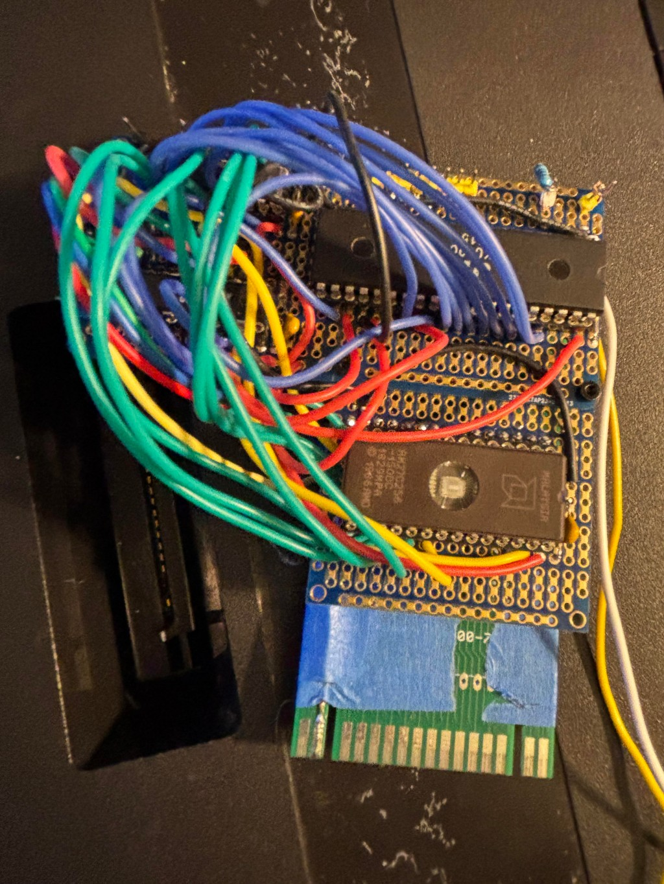

# Lokey 7800 YM

## What is this project?

The goal is to provide a stable, low-cost (~$2 USD) bridge between the Atari 7800 and the Atari ST. By leveraging the YM2149 PSG—or modern clones like the **KC89C72** (used in this project) which are still in production—we can bring rich, standardized three-channel sound to the 7800 with 100% Atari ST asset compatibility. Original YM2149 chips remain widely available as used or New-Old-Stock (NOS) parts at similar price points.

This repository is a playground for experiments with the Atari 7800 using a YM2149 on a cartridge.

## Status: **STABLE ALPHA / "IT ACTUALLY WORKS!" (Work in Progress)**

> This project has successfully graduated from its early breadboard phase to **Stable Alpha**. We have officially achieved highly accurate sound on real hardware. (Beta status is reserved for the first professional PCB run!) This project is still being actively developed and is a work in progress.

### Feature Demo: The "ANCOOL1" Stress Test

The video below shows the 7800 playing a full 92-second capture of the "ANCOOL1" track. This served as our stress test: by filling **96% of a single 32KB ROM bank** with a bitmask-compressed stream, we have proven the stability of the GAL address decoding, latch, and the efficiency of our 6502 playback engine.

> **Note on "Boot Interference":** You may notice some minor PSG noise/static during the initial boot sequence. This is a known hardware quirk we are still smoothing out—though we're half-tempted to leave it in for that authentic "hacker" aesthetic!

**Comparison:** See the [original Atari ST Demo](https://www.youtube.com/watch?v=oC4D_XVIZwQ) from which this track was captured to hear how the 7800 compares to the 16-bit original.

Click below to see it running on **real 7800 hardware**:

[](https://www.youtube.com/shorts/LWzkfaaal2E)

### Current Working Prototype (Cartridge)



### Early Proof of Concept (Breadboard)

*Note: This version served as the initial validation and is no longer maintained.*


## Build

By default, sources build with the 128-byte A78 header (good for emulators):

```bash
make a78
```

To build raw ROM images (no A78 header, good for EPROM burning), set
`build_with_header=0`:

```bash
make bin
```

To clean all generated files (ROMs, temporary binaries, and GAL output):

```bash
make clean
```

### Assembler & Toolchain

The source code is currently written for the **DASM** assembler to facilitate rapid prototyping and get the initial hardware working. "Hardware working first" is the current priority.

Once the project is stable, we plan to transition to a more robust toolchain:
- **cc65**: To leverage its powerful macro assembler and flexible linking options.
- **MADS**: Widely considered one of the best Atari assemblers available.

### Quick Start (Emulator)

You can download and run our verified music demos directly in the emulator:

- **Download**: [ym2149_player_ancool1.a78](docs/ym2149_player_ancool1.a78) (92-second bitmask stream)
- **Download**: [ym2149_player_enchant1.a78](docs/ym2149_player_enchant1.a78) (Melodic bitmask stream)

These ROMs use the specialized physical mapping described below.

## Emulator Support

To iterate rapidly without burning EPROMs, you can use these specialized forks that include full support for the physical YM2149 hardware mapping.

### A78 Header & Emulator Detection

The project uses a **v4 A78 Header** (an extension of the standard 128-byte header) to signal to the emulator that YM2149 hardware is present. This avoids the need for manual emulator configuration.

- **Header Version**: `4` (Offset 0)
- **Audio Flags (Hi)**: Bit 6 is set (`%01000000`) to indicate YM2149 presence (Offset 66).
- **Mapper**: `0` (Linear/No Bankswitching, Offset 64).

When the `a7800` or `js7800` forks detect this flag in a `.a78` file, they automatically enable the YM2149 engine and map it to the $4000-$7FFF range.

### a7800 (Desktop)
The premier desktop emulator for the 7800, now updated with physical YM2149 support and modern development fixes.

- **Repository**: [https://github.com/jbsohn/a7800](https://github.com/jbsohn/a7800)
- **Branch**: `ym2149`
- **Key Enhancements**:
  - **Native Apple Silicon Support**: Runs natively on **macOS M1/M2/M3** CPUs. Unlike the official release, this fork does not require Rosetta and provides full native performance.
  - **Modernized Build System**: Updated to compile cleanly with current toolchains on Linux and macOS.
  - **Hardware Accuracy**: Implements the exact 16000-byte physical memory mapping ($4000–$7FFF) used by this project.
  - **AY/YM Engine**: Full emulation of the YM2149 PSG, synchronized with the 7800 PHI2 clock.

### js7800 (Web-based)
A browser-based emulator that allows for zero-setup testing and sharing.

- **Live Demo**: [**Play the YM2149 Demo in your Browser**](https://jbsohn.github.io/js7800-ym-player/)
- **Repository**: [https://github.com/jbsohn/js7800](https://github.com/jbsohn/js7800)
- **Branch**: `ym2149`
- **Key Enhancements**:
  - **WebAudio Integration**: Bridges the 6502 register writes to the browser's audio engine for real-time YM2149 playback.
  - **Rapid Iteration**: The fastest way to test your `.a78` builds—just drag and drop into the browser.
  - **Cross-Platform**: Works anywhere a modern browser runs, making it the ideal "first test" for music assets.

## Signing for Real 7800 Hardware

Atari 7800 cartridges must be cryptographically signed. After building a raw
`.bin`, run `7800sign -w` to write the signature into the ROM image:

```bash
7800sign -w ym2149_heartbeat_main.bin
7800sign -t ym2149_heartbeat_main.bin
```

Alternatively, you can sign all generated `.bin` files automatically using the provided Makefile target:

```bash
make hw
```

Important ROM footer requirement for `7800sign`:

- `$FFF8` must be `$FF`
- `$FFF9` low nibble must be `3` or `7` (for a 32KB image at `$8000`, use `$83`)

In assembly source:

```asm
org $fff8
.byte $ff
.byte $83
org $fffa
.word reset
.word reset
.word reset
```

## Output Formats

- `.a78`: 128-byte A78 header + 32 KB ROM (32,896 bytes total). Use for emulators.
- `.bin`: raw 32 KB ROM only (32,768 bytes). Use for EPROM programming / real cartridge testing.

For real hardware, start with **ym2149_heartbeat_main.bin**. It is our **Stable Alpha** baseline that has been verified stable in preliminary tests on the Atari 7800.

## Memory Mapping & POKEY Compatibility

The YM2149 sound card is mapped to the **$4000–$7FFF** range (16 KB).

### Write-Only Mirroring (Theoretical)

The current GAL logic is gated by the `!RW` (Read/Write) line. This means the YM2149 should effectively be a "write-only" device at $4000. In theory, this allows other devices (like ROM or RAM) to reside at the same memory addresses for **read** operations without bus contention.

> **NOTE:** This "Stealth Mirroring" is the intended design but remains untested on live hardware. It represents one of our "hopes" for maximum bus efficiency!

This mapping is intentional: it follows the historical precedent set by classic Atari 7800 games like **Ballblazer** and **Commando**, which mapped the **POKEY** sound chip to $4000. By mirroring this 16 KB "Sound Area," we ensure high compatibility with existing hardware designs and make it easier for 7800 developers to swap or supplement POKEY with the YM2149.

## PCB Design Workflow (tscircuit)

Unlike traditional hardware projects, this project uses a **Code-to-PCB** workflow. The "Source of Truth" for the schematic is not a visual diagram, but the React-based circuit code found in `pcb/index.circuit.tsx`.

We leverage **tscircuit**, a TypeScript framework that allows us to define electronic components and layouts using React. This ensures that our hardware logic is version-controllable, modular, and precisely mapped to the Atari 7800's technical specifications.

### Generated Schematic

> **NOTE:** This PDF is a generated preview intended for visual reference. It is **not guaranteed to be the latest version** of the hardware logic. Always refer to `pcb/index.circuit.tsx` for the authoritative design.

[Atari 7800 YM2149 Cartridge Schematic](pcb/schematic.pdf)

### Hardware Status

The current design includes:

- **Full YM2149 / AY-3-8910 Support**: Integrated via a 74HCT373 latch.
- **A78 Maxi Connector**: A precise 32-pin physical layout that accounts for the 7800's alignment notches.
- **Professional Constraints**: Baked-in design rules (0.25mm traces, 0.8mm vias) sourced from the [Otaku-flash](https://github.com/karrika/Otaku-flash) project.
- **Socket-Ready**: All ICs use standard DIP through-hole footprints.

### Environment Setup

The PCB project requires **Node.js** and the **tscircuit CLI**.

1. **Install Dependencies**: Navigate to the `pcb` directory and install the required npm packages:

   ```bash
   cd pcb
   npm install
   ```

2. **Install CLI Tools**: Ensure you have the `tsci` tool installed globally to run the interactive viewer:

   ```bash
   npm install -g tscircuit
   ```

### Build Instructions

To live-preview the latest PCB design and footprints, run the development server:

```bash
cd pcb
npm run dev
```

This will launch the `tscircuit` viewer in your browser, allowing you to inspect the schematic, PCB layout, and 3D preview in real-time.

## GAL Logic ([galette](https://github.com/simon-frankau/galette))

This project uses **[galette](https://github.com/simon-frankau/galette)**, an open-source GAL assembler, for its active development workflow. This allows for a completely open-source toolchain on Linux and macOS without requiring legacy Windows-only tools like WinCUPL.

### Logic Files

1. **[gal/rom.pld](gal/rom.pld)**: A simple 32KB ROM decoder in **[galette](https://github.com/simon-frankau/galette)** format.
2. **[gal/rom_ym.pld](gal/rom_ym.pld)**: The full YM2149 address decoder in **[galette](https://github.com/simon-frankau/galette)** format.

To compile the GAL logic into a JEDEC file for programming, run:

```bash
make gal
```

### WinCUPL Archive (Golden Reference)

The original WinCUPL-formatted source files are preserved in the **[gal/wincupl/](gal/wincupl/)** directory.

During development, these served as the "Source of Truth" to verify that the **[galette](https://github.com/simon-frankau/galette)** port produced 100% bit-for-bit identical logic. They remain in the repository for archival purposes and for users who prefer to use the official Microchip/Atmel WinCUPL environment.

## Hardware Wiring

To connect a **YM2149** (or **AY-3-8910**) to the Atari 7800 using the provided `rom_ym.pld` logic:

### 1. GAL16V8 Pinout (`rom_ym.pld`)

| Pin | Signal | Source |
| :--- | :--- | :--- |
| 2 | A15 | 7800 Address Bus |
| 3 | A14 | 7800 Address Bus |
| 4 | A0 | 7800 Address Bus |
| 5 | HALT | 7800 Maria Halt Signal |
| 6 | R/W | 7800 CPU R/W Line |
| 7 | PHI2 | 7800 CPU Clock (Pin 28 on Cart) |
| 15 | **YM_LE** | Latch Enable output to 74HCT373 Pin 11 |
| 16 | **PHI2OUT** | Buffered Clock to YM Pin 22 |
| 17 | **BC1** | Connect to YM Pin 29 |
| 18 | **BDIR** | Connect to YM Pin 27 |
| 19 | **!ROM_CE** | Connect to 27C256 ROM Pin 20 (~CE) |
| 20 | VCC | +5V |

### 2. 74HCT373 Octal Latch Connections

| Latch Pin | Signal | Connection | 27C256 ROM Pin |
| :--- | :--- | :--- | :--- |
| 1 | ~OE | Ground (Always Enable) or GAL Output | - |
| 2 | Q0 | YM Pin 37 (DA0) | - |
| 3 | D0 | 7800 Data Bus D0 | Pin 11 (O0) |
| 4 | D1 | 7800 Data Bus D1 | Pin 12 (O1) |
| 5 | Q1 | YM Pin 36 (DA1) | - |
| 6 | Q2 | YM Pin 35 (DA2) | - |
| 7 | D2 | 7800 Data Bus D2 | Pin 13 (O2) |
| 8 | D3 | 7800 Data Bus D3 | Pin 15 (O3) |
| 9 | Q3 | YM Pin 34 (DA3) | - |
| 10 | GND | Ground | - |
| 11 | LE | Latch Enable (from GAL Pin 15 **YM_LE**) | - |
| 12 | Q4 | YM Pin 33 (DA4) | - |
| 13 | D4 | 7800 Data Bus D4 | Pin 16 (O4) |
| 14 | D5 | 7800 Data Bus D5 | Pin 17 (O5) |
| 15 | Q5 | YM Pin 32 (DA5) | - |
| 16 | Q6 | YM Pin 31 (DA6) | - |
| 17 | D6 | 7800 Data Bus D6 | Pin 18 (O6) |
| 18 | D7 | 7800 Data Bus D7 | Pin 19 (O7) |
| 19 | Q7 | YM Pin 30 (DA7) | - |
| 20 | VCC | +5V | - |

### 3. YM2149 / AY-3-8910 Connections

| YM Pin | Signal | Connection |
| :--- | :--- | :--- |
| 1 | GND | Ground |
| 22 | CLOCK | **PHI2OUT (GAL Pin 16)** |
| 23 | /RESET | +5V |
| 24 | /A9 | GND |
| 25 | A8 | +5V |
| 27 | BDIR | GAL Pin 18 |
| 28 | BC2 | +5V |
| 29 | BC1 | GAL Pin 17 |
| 30 | DA7 | 74HCT373 Q7 (Pin 19) |
| 31 | DA6 | 74HCT373 Q6 (Pin 16) |
| 32 | DA5 | 74HCT373 Q5 (Pin 15) |
| 33 | DA4 | 74HCT373 Q4 (Pin 12) |
| 34 | DA3 | 74HCT373 Q3 (Pin 9) |
| 35 | DA2 | 74HCT373 Q2 (Pin 6) |
| 36 | DA1 | 74HCT373 Q1 (Pin 5) |
| 37 | DA0 | 74HCT373 Q0 (Pin 2) |

1. **Clocking**: Pin 22 (CLOCK) typically receives PHI2OUT from the GAL (1.79 MHz) for 1:1 emulator parity. However, the logic is robust enough to support an external 2 MHz crystal directly. This provides exact Atari ST sound compatibility for imported assets without needing software frequency adjustments.

## Playback & Clock Accuracy

Porting audio from the Atari ST (16-bit 68000) to the Atari 7800 (8-bit 6502) involves managing several technical discrepancies:

- **Chip Clocks**: The Atari ST's YM2149 typically runs at **2.0 MHz**, while the Atari 7800's PHI2 clock (and thus the YM clock in our default mapping) is approximately **1.79 MHz**.
- **Refresh Rates**: Original YM tracks were often composed for **50Hz (PAL)** or **60Hz (NTSC)**. The Atari 7800 also supports both **50Hz** and **60Hz** output depending on the region.
- **CPU Overhead**: The 6502 must spend cycles parsing the compressed stream, which can introduce micro-variations in timing compared to the ST's 68000.

**How we handle this**: The `YmToBin.cs` tool performs **Automatic Pitch Scaling**. It calculates the ratio between the source chip clock and the 7800's 1.79 MHz clock, re-calculating every frequency register to keep the music in tune. While this achieves "Accurate" sound, subtle "character" differences from the original hardware may remain.

## Included Tools

All diagnostic and processing tools in this repository require the **.NET SDK**. They have been verified on **Linux** and **macOS** (Intel and Apple Silicon). 

> **Note on Windows**: These tools are currently **untested** on Windows. While they should run via `dotnet script`, the build environment and shell-based diagnostics have not been verified for that platform yet.

### `tools/YmToBin.cs`

> **WORK IN PROGRESS**: While this tool currently provides a stable and functional "Pattern-Based Delta" format for the Atari 7800, research into even more efficient storage methods is ongoing to maximize the music capacity of future cartridges.

A high-performance YM (Atari ST/Amstrad CPC) to Atari 7800 binary converter. It processes raw YM register streams into a highly compressed format suitable for 8-bit playback.

[**View Technical Documentation**](docs/YmToBin.md)


- **Supported Formats**: YM2, YM3, YM4, YM5, and YM6.
- **Key Features**:
  - **Pitch Scaling**: Automatically adjusts frequency registers to account for the difference between the original chip clock (e.g., 2.0MHz) and the Atari 7800's PHI2 clock (1.79MHz).
  - **Multi-Stage Compression**:
    - **Pattern-Based**: Identifies repeating sequences of frames and extracts them into a "Pattern Table" to save space.
    - **Bitmask Deltas**: Within each pattern, only registers that *change* between frames are stored, using a 16-bit mask.
  - **Auto-Optimization**: If no pattern size is provided, the tool automatically tests multiple sizes (16, 32, 64, etc.) to find the best compression ratio for your specific song.
  - **Delay Calculation**: Computes the optimal `DEX/BNE` delay loop values (Y and X) to maintain consistent playback speed on the 6502.
- **Requirements**:
  - **.NET SDK**: Required to run the C# script.
  - **7-Zip (`7z`)**: Required to extract compressed `.ym` files (LZH archives). Ensure `7z` is in your system PATH.
- **Usage**:
  ```bash
  dotnet script tools/YmToBin.cs <input.ym> [options]
  ```
  - `<input.ym>`: Input YM file (required positional argument).
  - `-o <file>`: Output binary file (default: input.bin).
  - `-f <frames>`: Limit the number of frames to process (default: 65535).
  - `-p <size>`: Fixed size for pattern blocks (set to 0 for auto-optimization).
  - `-s <step>`: Frame skipping used to balance audio fidelity against ROM space.
    - **Step 1 (Full Fidelity - 50Hz/60Hz)**: Full fidelity, largest size.
    - **Step 2 (The "Sweet Spot" - 25Hz/30Hz)**: Halves the data size with minimal impact on sound quality.
    - **Step 3 (Maximum Compression - ~16Hz/20Hz)**: Noticeable melody stutter, but saves the most space.
  - `-hz <value>`: Override the player frequency (e.g., force a 50Hz song to play at 60Hz).

### `tools/ValidateCartSignals.cs`

A diagnostic C# script used to validate the raw physical signals coming off the Atari 7800 cartridge edge connector before they reach the ROM or YM2149.

- **Requirements**: `sigrok-cli` and `dotnet-script` installed globally.
- **Usage**: Run `./tools/ValidateCartSignals.cs` from the project root. It captures 100,000 samples at 24MHz using a logic analyzer (defaults to `fx2lafw`).
- **Output**: Analyzes the CSV stream in real-time and reports the total number of low-to-high transitions for the `PHI2` Clock, `R/W`, `HALT`, and `A15` pins.

### `tools/ValidateGalSignals.cs` & `tools/ValidateLatchEnable.cs`

Advanced diagnostics for stabilized timing. These tools use 2MHz sampling to detect "shattered" pulses and mid-cycle address bus noise.

- **Validation**: Ensures `YM_LE`, `BDIR`, and `BC1` only fall when `PHI2` falls.
- **BC1 Monitor**: Confirms the GAL is correctly identifying `A0=0` for register selection.

## Baseline ROM: `ym2149_heartbeat_main.asm`

This is our **Stable Alpha** baseline. It verified that:

1. **Pitch**: Matches the emulator.
2. **Stability**: No notes are dropped (Uses the optimized **Uno-Write** pattern).
3. **Cleanliness**: No stuttering (PHI2-Synchronized logic protects the bus).

**Tempo**: 1.0 seconds per note (Ideal for hardware verification).

### The "Software Heartbeat"

You may notice the background color flashing rapidly during our demos. This is an intentional **Software Heartbeat**. In bare-metal development without a debugger, this serves as our primary diagnostic tool:

- **Flashing**: The 6502 is alive and successfully executing the main loop.
- **Frozen**: The system has crashed or is stuck in an infinite loop.
- **Consistent Cycle**: Confirms our VBI/Delay timing is hitting the expected 50Hz/60Hz targets.

For this "Lab" project, we've kept this heartbeat active to prove that the music playback is leaving plenty of CPU "breathing room" for future game logic. In fact, this diagnostic proved its worth dozens of times during early development, providing the only visual indicator that the code had locked up before we stabilized the bus timing!

### Hardware Tests in Action

Check out the current state of tests running on the dev board:

[](https://www.youtube.com/shorts/xwr_qn-GMdQ)

[](https://www.youtube.com/shorts/qCsVi0Iiq5I)

## Acknowledgements & Credits

- **Karri Kaksonen (karrika)**: For the excellent [Otaku-flash](https://github.com/karrika/Otaku-flash) project. We have integrated the **Stable Alpha** Atari 7800 cartridge footprints, symbols, and professional design rules from this MIT-licensed repository.
- **Simon Frankau ([galette](https://github.com/simon-frankau/galette))**: For the open-source **galette** GAL assembler. It provides a modern, cross-platform toolchain that saved us from the Windows VM nightmare of WinCUPL. Thanks for keeping our development environment in the 21st century!
- **Dan Boris (AtariHQ)**: For the indispensable [7800 Cartridge Technical Specifications](https://atarihq.com/danb/7800cart/a7800cart.shtml) and reference diagrams that made this hardware mapping possible.
- **Arnaud Carré (Leonard/OXG)**: For the excellent [StSound](https://github.com/arnaud-carre/StSound) project. The `samples/` directory contains melodic assets sourced from this project for hardware testing.
- **The Atari Community**: We are grateful to the dedicated fans keeping the 16-bit and 8-bit flames alive through archival and homebrew development.

## Future Plans & Extensibility

- **Hardware Roadmap**: Our MVP (Minimum Viable Project) focus is a stable **32KB ROM (27C256)** that plays music reliably on real hardware. Future revisions will expand compatibility to support all **28-pin ROMs**, eventually moving to **32-pin ROMs** and more complex bank-switching versions.
- **YM2 as Canonical Source**: We have established **YM2** as the preferred "raw" source format for incoming Atari ST data. Its logic overhead and predictable register-interleaving makes it the ideal baseline for future compression research.
- **Advanced Compression**: Future research will explore **RLE (Run-Length Encoding)** and custom **Bitpacking** (similar to VGM or YM-Pro formats) to squeeze minutes of high-fidelity music into standard 32KB/48KB 7800 banksets.
- **I/O Port Logging**: The YM2149 I/O ports provide 16 additional lines of communication. We plan to implement a high-speed "Diagnostic Logging" system to stream real-time debug data back from the 7800 to a host machine.
- **Enhanced Interfacing**: Using the spare ports for external controllers or status LEDs to assist in hardware bring-up.

## Hardware Pinout Reference

From [AtariHQ](https://atarihq.com/danb/7800cart/a7800cart.shtml):

### 7800 Cartridge Edge (32-Pin)


*Image credit: [Dan Boris / AtariHQ](https://atarihq.com/danb/7800cart/a7800cart.shtml) (Used for educational/reference purposes)*

| Pin (1–16) | Signal Description | Pin (32–17) | Signal Description |
| :--- | :--- | :--- | :--- |
| **1** | Read/Write (from 6502, low=Write) | **32** | Phase 2 Clock (from 6502) |
| **2** | Halt (to 6502) | **31** | IRQ (to 6502) |
| **3** | D3 (to/from 6502) | **30** | Ground |
| **4** | D4 (to/from 6502) | **29** | D2 (from 6502) |
| **5** | D5 (to/from 6502) | **28** | D1 (from 6502) |
| **6** | D6 (to/from 6502) | **27** | D0 (from 6502) |
| **7** | D7 (to/from 6502) | **26** | A0 (from 6502) |
| **8** | A12 (from 6502) | **25** | A1 (from 6502) |
| **9** | A10 (from 6502) | **24** | A2 (from 6502) |
| **10** | A11 (from 6502) | **23** | A3 (from 6502) |
| **11** | A9 (from 6502) | **22** | A4 (from 6502) |
| **12** | A8 (from 6502) | **21** | A5 (from 6502) |
| **13** | +5 VDC | **20** | A6 (from 6502) |
| **14** | Ground | **19** | A7 (from 6502) |
| **15** | A13 (from 6502) | **18** | External Audio Input |
| **16** | A14 (from 6502) | **17** | A15 (from 6502) |

**Backward Compatibility:** Pins 3–14 and 19–30 are identical to the Atari 2600 standard. This allows the 7800 to be physically backward compatible with 2600 cartridges. The remaining pins are specific to the 7800 and enable its expanded memory and sound capabilities.

### 27C256 EPROM (32KB ROM)

| Pin (Left) | Signal | Pin (Right) | Signal |
| :--- | :--- | :--- | :--- |
| **1** | VPP (12.5V or VCC) | **28** | VCC (+5V) |
| **2** | A12 (7800 Cart Pin 8) | **27** | A14 (7800 Cart Pin 16) |
| **3** | A7 (7800 Cart Pin 19) | **26** | A13 (7800 Cart Pin 15) |
| **4** | A6 (7800 Cart Pin 20) | **25** | A8 (7800 Cart Pin 12) |
| **5** | A5 (7800 Cart Pin 21) | **24** | A9 (7800 Cart Pin 11) |
| **6** | A4 (7800 Cart Pin 22) | **23** | A11 (7800 Cart Pin 10) |
| **7** | A3 (7800 Cart Pin 23) | **22** | !OE (Output Enable - Ground) |
| **8** | A2 (7800 Cart Pin 24) | **21** | A10 (7800 Cart Pin 9) |
| **9** | A1 (7800 Cart Pin 25) | **20** | !CE (Chip Enable - GAL Pin 19) |
| **10** | A0 (7800 Cart Pin 26) | **19** | Q7 (Data D7 - Latch Pin 18) |
| **11** | Q0 (Data D0 - Latch Pin 3) | **18** | Q6 (Data D6 - Latch Pin 17) |
| **12** | Q1 (Data D1 - Latch Pin 4) | **17** | Q5 (Data D5 - Latch Pin 14) |
| **13** | Q2 (Data D2 - Latch Pin 7) | **16** | Q4 (Data D4 - Latch Pin 13) |
| **14** | GND (Ground) | **15** | Q3 (Data D3 - Latch Pin 8) |

### AY-3-8910 / YM2149 PSG (40-Pin)

| Pin (Left) | Signal | Pin (Right) | Signal |
| :--- | :--- | :--- | :--- |
| **1** | VSS (Ground) | **40** | VCC (+5V) |
| **2** | N.C. | **39** | TEST 1 |
| **3** | Analog Channel B | **38** | Analog Channel C |
| **4** | Analog Channel A | **37** | DA0 (Data/Address Bit 0) |
| **5** | N.C. | **36** | DA1 (Data/Address Bit 1) |
| **6** | IOB7 | **35** | DA2 (Data/Address Bit 2) |
| **7** | IOB6 | **34** | DA3 (Data/Address Bit 3) |
| **8** | IOB5 | **33** | DA4 (Data/Address Bit 4) |
| **9** | IOB4 | **32** | DA5 (Data/Address Bit 5) |
| **10** | IOB3 | **31** | DA6 (Data/Address Bit 6) |
| **11** | IOB2 | **30** | DA7 (Data/Address Bit 7) |
| **12** | IOB1 | **29** | BC1 (Bus Control 1) |
| **13** | IOB0 | **28** | BC2 (Bus Control 2) |
| **14** | IOA7 | **27** | BDIR (Bus Direction) |
| **15** | IOA6 | **26** | SEL (YM2149 Clock Div Select) |
| **16** | IOA5 | **25** | A8 (Address 8 - Tie High) |
| **17** | IOA4 | **24** | !A9 (Address 9 - Tie Low) |
| **18** | IOA3 | **23** | !RESET (Reset - Tie High) |
| **19** | IOA2 | **22** | CLOCK (Master Clock Input) |
| **20** | IOA1 | **21** | IOA0 |

**Note:** On the YM2149, Pin 26 (**SEL**) acts as an internal clock divider. When tied **Low**, the master clock is divided by 2. When tied **High**, the clock is used as-is. On the original AY-3-8910, this pin is part of the bus control logic.

## AI Assistance

This project was developed with assistance from AI. For the author, AI has been a "force multiplier"—making it possible to tackle long-held "I've always wanted to do this" projects within the limited hours of evenings and weekends.

For reflections on the legacy of the Atari ST and how AI is changing the landscape of hardware and software side-projects, see the author's blog posts:

[John's Music & Tech](https://johnsmusicandtech.com/)

## License & No Warranty

This project is licensed under the **GNU General Public License v2.0 (GPL-2.0)**. See the `LICENSE` file for details.

**Use at your own risk.** The author is not responsible for any damage to your hardware, loss of data, or any other issues that may arise from using this code, following the wiring diagrams, or running the provided tools. There is no warranty, Expressed or Implied.
