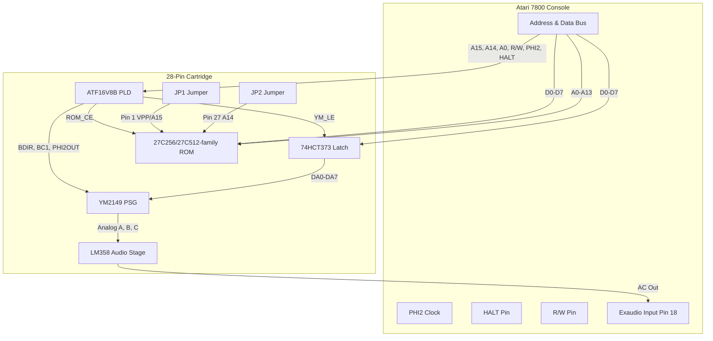

# 28-Pin Board — Theory of Operation & Assembly Guide

This document covers the **28-pin ROM board** (`pcb/28pin.circuit.tsx`, formerly "Rev 1"): a single-YM2149, jumper-configurable-ROM-size cartridge. For the shared memory map and pinout references common to all board variants, see [Hardware.md](Hardware.md). For the larger dual-YM/bank-switching board, see [Hardware-32pin.md](Hardware-32pin.md).

## BOM Cost Estimation (Per Unit)

The 28-pin board is designed for high performance at a hobbyist-friendly price point.

| Component | Estimated Cost | Notes |
| :--- | :--- | :--- |
| **YM2149 / AY-3-8910 Clone** | $2.00 | Targeted price for bulk/clones |
| **ATF16V8B (PLD)** | $0.85 | Modern replacement for legacy GAL16V8 |
| **27C256 (32KB EPROM)** | $1.50 | Standard game ROM (16KB/64KB parts also supported, see jumper table below) |
| **74HCT373 (Octal Latch)** | $0.40 | Address latching |
| **LM358 (Op-Amp)** | $0.10 | Active audio amplification |
| **Passives (R/C)** | $0.15 | Reset circuit and audio stage |
| **Total (Excl. PCB)** | **~$5.00** | |

## Logic Compilation (ATF16V8B)

The cartridge uses a programmable logic device (typically an **ATF16V8B** or legacy **GAL16V8**) to handle the address decoding and bus control logic.

This project uses [**galette**](https://github.com/simon-frankau/galette), an open-source logic assembler, for a modern, cross-platform toolchain.

To compile the logic into JEDEC files (for use with a device programmer):
```bash
make logic
```

---

## 1. System Architecture

The 28-pin board bridges the Atari 7800 console's expansion bus with a YM2149 Sound Generator (PSG) and a game EPROM (up to 64KB, jumper-selectable).



---

## 2. Address Decoding & Memory Map

The PLD (`U_GAL` — ATF16V8B) acts as the address decoder, monitoring address lines `A15` and `A14` to divide the memory map (see [Hardware.md](Hardware.md#memory-mapping) for the full $4000/$4001 register mapping shared across boards):

* **ROM reads ($4000–$FFFF)**:
  * When `RW = 1` (read) and (`A15 = 1` or `A14 = 1`), the PLD asserts `/ROM_CE` (Pin 19) `LOW`, enabling the EPROM (`U_ROM`).
  * The ROM drives the data bus (`D0–D7`) to return game instructions. This covers both the $8000–$FFFF (32KB, `A15=1`) and $4000–$7FFF (16KB, `A14=1`) windows — see the jumper table in [§7](#7-solder-jumper-configurations-rom-size) for how much of this is actually usable per ROM size.
* **Sound Card Register Space ($4000–$4001, writes only)**:
  * The PLD asserts YM2149 control signals when `A15 = 0` and `A14 = 1` during write cycles (`R/W = 0`). Since `RW = 0` here, `/ROM_CE` is not asserted, so there's no bus contention between the write-only YM2149 and the ROM's read path.

### ATF16V8B Pinout (`U_GAL`)

Logic source: `gal/rom_ym.pld`.

| Pin | Signal | Source / Destination |
| :--- | :--- | :--- |
| 1 | CLK | Unused |
| 2 | A15 | 7800 Address Bus |
| 3 | A14 | 7800 Address Bus |
| 4 | A0 | 7800 Address Bus |
| 5 | HALT | 7800 Maria Halt Signal |
| 6 | R/W | 7800 CPU R/W Line |
| 7 | PHI2 | 7800 CPU Clock (Cart Pin 32) |
| 15 | **YM_LE** | Latch Enable → 74HCT373 Pin 11 |
| 16 | **PHI2OUT** | Buffered Clock → U_YM Pin 22 |
| 17 | **BC1** | → U_YM Pin 29 |
| 18 | **BDIR** | → U_YM Pin 27 |
| 19 | **!ROM_CE** | → U_ROM Pin 22/20 (~CE, ROM-size dependent) |
| 20 | VCC | +5V |

---

## 3. Data & Address Multiplexing (74HCT373)

The YM2149 uses a multiplexed address/data bus (`DA0–DA7`), while the Atari 7800 separates them.

* The **74HCT373 Octal Latch (`U_LATCH`)** bridges this gap:
  * When the CPU writes to the sound registers, the PLD asserts `YM_LE` (Latch Enable) `HIGH`.
  * This stores the current data bus value (`D0–D7`) in the latch.
  * The latch outputs (`Q0–Q7`) drive the YM2149's multiplexed pins (`DA0–DA7`), holding the address or data stable for the PSG.

| Latch Pin | Signal | Connection |
| :--- | :--- | :--- |
| 1 | ~OE | Ground |
| 2–9 | Q0–Q7 | U_YM DA0–DA7 |
| 3–18 | D0–D7 | 7800 Data Bus D0–D7 |
| 11 | LE | PLD Pin 15 (`YM_LE`) |
| 20 | VCC | +5V |
| 10 | GND | Ground |

---

## 4. YM2149 / AY-3-8910 Connections (U_YM)

| YM Pin | Signal | Connection |
| :--- | :--- | :--- |
| 22 | CLOCK | PHI2OUT (PLD Pin 16) |
| 27 | BDIR | PLD Pin 18 |
| 29 | BC1 | PLD Pin 17 |
| 28 | BC2 | VCC |
| 25 | A8 | VCC |
| 24 | !A9 | GND |
| 23 | !RESET | RESET_DELAYED (RC network, see [§5](#5-hardware-reset--warm-start-fix)) |
| 30–37 | DA7–DA0 | 74HCT373 Q7–Q0 |

---

## 5. Hardware Reset & Warm Start Fix

A common issue with retro PSG cartridges is a high-frequency stuck hum on system reset or quick power-cycle ("Warm Start"), caused by a quick power cycle bypassing the console's default internal BIOS delays and leaving the YM2149 registers holding garbage data. The **RC Reset Delay network (`R_RESET` / `C_RESET`)** on YM **Pin 23 (!RESET)** solves this.

### Connection & Wiring Guide

The two components meet at a single node connected directly to Pin 23 (!RESET) of the YM2149:

1. **Pull-up resistor (10kΩ):** VCC → Pin 23 (!RESET).
2. **Capacitor (10µF, polarized):** positive (+) terminal → Pin 23 (!RESET), negative (−) terminal → GND.

> **Note:** No manual reset switch is fitted on the PCB. The RC network provides automatic power-on reset only. For a manual override on a breadboard build, wire a normally-open switch in parallel with the capacitor (one contact to `!RESET`, the other to GND) — not required for normal cartridge operation.

### Theory of Operation

At power-up, the discharged capacitor acts as a momentary short to ground, holding `!RESET` low while the +5V rail stabilizes. The capacitor charges through the 10kΩ resistor over roughly 100ms, then releases `!RESET` high and allows the PSG to begin normal operation. This delay ensures the console BIOS has had time to silence the audio channels before the YM2149 comes out of reset, preventing the warm-start stuck-tone issue.

---

## 6. Audio Stage (LM358 — Active-Passive Hybrid Shunt Mixer)

The audio stage uses an LM358 op-amp (`U_AMP`) in a parallel **Active-Passive Hybrid Shunt** configuration. This design uses the op-amp's feedback loop and single-supply saturation limits to act as a passive load that prevents console audio clipping, while incorporating an AC shunt network to smooth out high-frequency square-wave edges.

| Pin | Signal | Connection |
| :--- | :--- | :--- |
| **1** | OUT1 | Op-amp output (feedback loop to Pin 2) |
| **2** | IN1_NEG | Summing node (connected directly to audio line) |
| **3** | IN1_POS | GND |
| **4** | GND | Ground Plane |
| **5** | IN2_POS | GND (unused channel stability) |
| **6** | IN2_NEG | OUT2 (Pin 7, unused channel stability) |
| **7** | OUT2 | IN2_NEG (Pin 6, unused channel stability) |
| **8** | VCC | +5V |

> **Note:** The unused second channel (Pins 5–7) is configured as a unity-gain buffer tied to ground to prevent oscillation and thermal instability.

> **Musician's Note on Op-Amps:** While this circuit is pin-compatible with higher-end op-amps like the **TL072**, real-world testing on the Atari 7800 showed that the humble **LM358** actually produced a more desirable "retro" tone. The LM358's performance on the single 5V rail adds a slight warmth and grit that perfectly complements the YM2149 PSG. That said, any pin-compatible op-amp can be used here.

**Audio Path Details:**

* **Summing Node**: YM2149 Channels A, B, and C each go through a **1kΩ isolation resistor** to a single summing node, which connects directly to Pin 2 of the op-amp.
* **Feedback Loop**: A **1kΩ resistor** connects the summing node (Pin 2) to the op-amp output (Pin 1). Since Pin 3 is grounded, the op-amp output sits at `0V`, making this resistor behave as a passive `1kΩ` load to ground that prevents console clipping.
* **Class-A Bias Pull-Down**: A **1kΩ resistor** connects from Pin 1 (OUT1) to ground (Pin 4) to bias the LM358's output stage into Class-A operation, eliminating crossover distortion.
* **AC Output Coupling Network**: A **1kΩ resistor** in series with a **10µF capacitor** connects Pin 1 (OUT1 / `0V`) to the Atari 7800's **Pin 18 (Exaudio)** input. The resistor connects to the capacitor's positive (+) terminal; the negative (−) terminal connects directly to the console's Exaudio line, blocking DC offset and smoothing square-wave transients.

---

## 7. Solder Jumper Configurations (ROM Size)

Before powering on the cartridge, bridge solder jumpers `JP1` and `JP2` to configure your ROM size:

| Jumper | Left pad | Right pad | Purpose |
| :--- | :--- | :--- | :--- |
| **JP1** | VCC | A15 | Pin 1 (VPP/A15): tie high for 16K/32K, or route A15 for 64K |
| **JP2** | VCC | A14 | Pin 27 (A14): tie high for 16K, or route A14 for 32K/64K |

| ROM size | JP1 (Pin 1, VPP/A15) | JP2 (Pin 27, A14) | Accessible |
| :--- | :--- | :--- | :--- |
| **16 KB (27C128)** | Bridge Left (VCC) | Bridge Left (VCC) | 16KB, mirrored across the decoded range |
| **32 KB (27C256)** | Bridge Left (VCC) | Bridge Right (A14) | 32KB |
| **64 KB (27C512)** | Bridge Right (A15) | Bridge Right (A14) | 48KB, **not mirrored** — see below |

> **Why 48KB, not 32KB, for the 64KB part:** `gal/rom_ym.pld`'s `/ROM_CE` equation asserts on *any* read (`RW=1`) where `A15=1` OR `A14=1` — not just `A15=1`. With JP1/JP2 both bridged right, the 7800's A15/A14 lines drive the ROM's own A15/A14 pins directly, so $8000–$FFFF (32KB, `A15=1`) and $4000–$7FFF (16KB, `A14=1`) each address a distinct region of the 64KB chip. That's 48KB of genuinely unique, addressable ROM content — not a mirrored 32KB.

> **Note:** This board has no address-line bank switching via software — ROM size selection is fixed at assembly time via the two solder jumpers. For software-controlled ROM bank switching (up to 512KB+) and a second cascaded YM2149, see the [32-pin board](Hardware-32pin.md).
