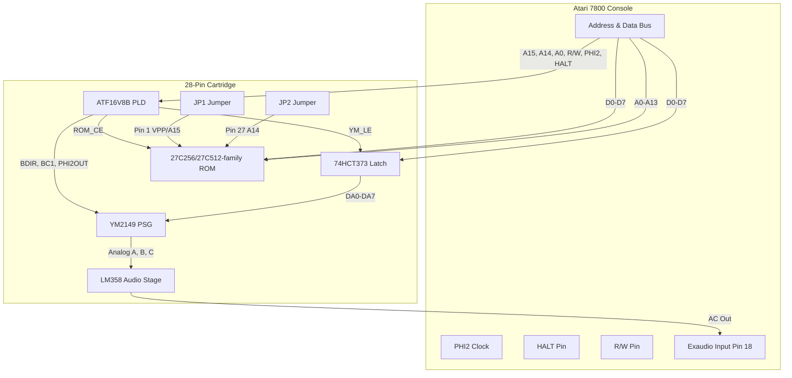

# 28-Pin Board — Theory of Operation & Assembly Guide

This document covers the **28-pin ROM board** (`pcb/28pin.circuit.tsx`, formerly "Rev 1"): a single-YM2149, jumper-configurable-ROM-size cartridge. For the shared memory map and pinout references common to all board variants, see [Hardware.md](Hardware.md). For the larger dual-YM/bank-switching board, see [Hardware-32pin.md](Hardware-32pin.md).

---

## 1. System Architecture

The 28-pin board bridges the Atari 7800 console's expansion bus with a YM2149 Sound Generator (PSG) and a game EPROM (up to 64KB, jumper-selectable).

---

## 2. Address Decoding & Memory Map

The PLD (`U_GAL` — ATF16V8B) acts as the address decoder, monitoring address lines `A15` and `A14` to divide the memory map (see [Hardware.md](Hardware.md#memory-mapping) for the full $4000/$4001 register mapping shared across boards):

* **Cartridge ROM Space ($8000–$FFFF)**:
  * When `A15 = 1`, the PLD asserts `/ROM_CE` (Pin 19) `LOW`, enabling the EPROM (`U_ROM`).
  * The ROM drives the data bus (`D0–D7`) to return game instructions.
* **Sound Card Register Space ($4000–$7FFF)**:
  * The PLD asserts YM2149 control signals when `A15 = 0` and `A14 = 1` during write cycles (`R/W = 0`).

### ATF16V8B Pinout (`U_GAL`)

| Pin | Signal | Source / Destination |
| :--- | :--- | :--- |
| 1 | CLK | Unused |
| 2 | A15 | 7800 Address Bus |
| 3 | A14 | 7800 Address Bus |
| 4 | A0 | 7800 Address Bus |
| 5 | HALT | 7800 Maria Halt Signal |
| 6 | R/W | 7800 CPU R/W Line |
| 7 | PHI2 | 7800 CPU Clock (Cart Pin 32) |
| 15 | **YM_LE** | Latch Enable → 74HCT373 Pin 11 |
| 16 | **PHI2OUT** | Buffered Clock → U_YM Pin 22 |
| 17 | **BC1** | → U_YM Pin 29 |
| 18 | **BDIR** | → U_YM Pin 27 |
| 19 | **!ROM_CE** | → U_ROM Pin 22/20 (~CE, ROM-size dependent) |
| 20 | VCC | +5V |

---

## 3. Data & Address Multiplexing (74HCT373)

The YM2149 uses a multiplexed address/data bus (`DA0–DA7`), while the Atari 7800 separates them.

* The **74HCT373 Octal Latch (`U_LATCH`)** bridges this gap:
  * When the CPU writes to the sound registers, the PLD asserts `YM_LE` (Latch Enable) `HIGH`.
  * This stores the current data bus value (`D0–D7`) in the latch.
  * The latch outputs (`Q0–Q7`) drive the YM2149's multiplexed pins (`DA0–DA7`), holding the address or data stable for the PSG.

---

## 4. Hardware Reset & Warm Start Fix

A common issue with retro PSG cartridges is a high-frequency stuck hum on system reset or quick power-cycle ("Warm Start").

* The **RC Reset Delay network (`R_RESET` / `C_RESET`)** solves this:
  * At power-on, the discharged `10µF` capacitor pulls `!RESET` to `GND`.
  * The capacitor charges slowly through the `10kΩ` pull-up resistor.
  * This keeps `!RESET` low for a few milliseconds after the +5V rail stabilizes, giving the console time to run its BIOS and silence the audio channels.

---

## 5. Audio Stage (LM358 — Inverting Summing Amp)

The YM2149's three analog channels (A, B, C) are mixed and buffered using an **LM358 Op-Amp (`U_AMP`)**:

1. **Mixing**: Channels A, B, and C are summed through three **1kΩ isolation resistors** into a single summing node (`net.SUM_NODE`).
2. **Buffering & Saturation**: The summing node connects to the inverting input of the LM358 (`IN1_NEG`). A **1kΩ feedback resistor** connects the output back to the input, preventing the output voltage from exceeding the single-supply limit and avoiding harsh console clipping.
3. **Class-A Bias**: A **1kΩ pull-down resistor** (`R_PULL`) biases the op-amp output stage into Class-A operation to eliminate crossover distortion.
4. **AC Coupling**: A series **1kΩ resistor** and **10µF capacitor** remove DC offset and smooth out the PSG's high-frequency square-wave transients before injecting the signal into the Atari's **External Audio Input (Exaudio Pin 18)**.

---

## 6. Solder Jumper Configurations (ROM Size)

Before powering on the cartridge, bridge solder jumpers `JP1` and `JP2` to configure your ROM size:

| ROM size | Jumper `JP1` (Pin 1, VPP/A15) | Jumper `JP2` (Pin 27, A14) | Notes |
| :--- | :--- | :--- | :--- |
| **16 KB (27C128)** | **Bridge Left (VCC)** | **Bridge Left (VCC)** | Ties `!PGM`/VPP high. ROM mirrors in both halves of the $8000–$FFFF space. |
| **32 KB (27C256)** | **Bridge Left (VCC)** | **Bridge Right (A14)** | Standard 32KB configuration. |
| **64 KB (27C512)** | **Bridge Right (A15)** | **Bridge Right (A14)** | Uses 64KB chips running a 32KB game — mirror or burn into the **upper half** (offset `$8000`). |

> **Note:** This board has no address-line bank switching via software — ROM size selection is fixed at assembly time via the two solder jumpers. For software-controlled ROM bank switching (up to 512KB+) and a second cascaded YM2149, see the [32-pin board](Hardware-32pin.md).
