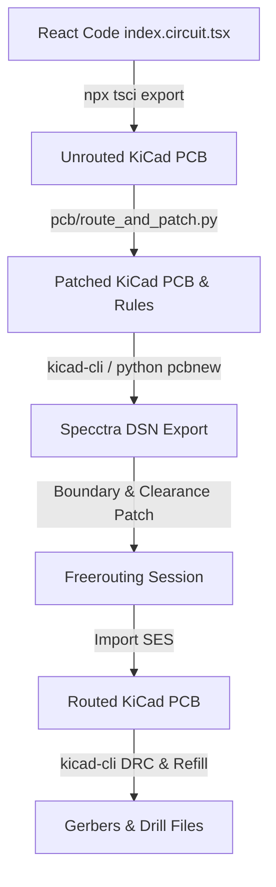

# PCB Design & Automated Routing Pipeline

> [!WARNING]
> **Work in Progress**: The PCB design is in an experimental prototype phase and is **not production-ready**. The physical board has **not yet been ordered or tested** for fabrication.

This document explains the architecture of the Atari 7800 YM2149 sound card cartridge PCB, how the automated compilation and routing pipeline works, and the design decisions made to work around current `tscircuit` limitations.

> [!NOTE]
> **Why we use a custom post-routing pipeline:**
> This project uses **tscircuit** to code-define all component placements, schematic connections, and the initial unrouted PCB footprints. We only use KiCad as a final post-processing stage to complete trace routing, apply low-level DRC patches, and generate manufacturing files. 
> 
> Because the native `tscircuit` layout engine and design-rule configurations are currently optimized for simpler boards, our build runner (`pcb/route_and_patch.py`) programmatically exports the unrouted design, patches the board parameters using the KiCad Python API, and offloads the double-sided routing to `Freerouting`.
> 
> **Important**: KiCad is used purely as a post-processing tool to push the `tscircuit` design over the finish line. This project is **not** intended to be developed or edited manually in KiCad; any manual modifications will be overwritten upon the next build.
> 
> As `tscircuit` matures, the ultimate goal is to eliminate these external scripts and perform all design rule configurations and routing natively within the framework.

---

## PCB Overview
The board is a **2-layer cartridge PCB** currently in the **experimental prototype phase (not production-ready)**. The project is still in its early stages, and the PCB has not yet been ordered for physical fabrication. While it interfaces the Atari 7800's expansion port to a YM2149 sound chip, address decoding logic, and audio pre-amplifier, mechanical verification and adjustments to fit standard cartridge shells remain a work-in-progress.

### Hardware Stack:
* **J1 (Atari 7800 Edge Connector)**: Custom edge connector card geometry.
* **U1 (27C256 ROM)**: Cartridge program storage.
* **U2 (ATF16V8B GAL)**: Address decoding logic.
* **U3 (74HCT373 Latch)**: Demultiplexes/latches the multiplexed data/address bus.
* **U4 (YM2149 Sound Chip)**: Synthesizes 3-channel audio.
* **U5 (LM358 Op-Amp)**: Active summing amplifier and output buffer.

### Board Previews:

| Front View (Top Copper & Silkscreen) | Back View (Bottom Copper & Silkscreen - Mirrored) |
| :---: | :---: |
|  |  |

---

## Compilation & Routing Pipeline

Because we maintain a code-first design, the single source of truth is `pcb/index.circuit.tsx`. Generating the final routed KiCad project and manufacturing-ready Gerber/Drill files is fully automated via the `make pcb` task. 

To quickly regenerate the side-by-side SVG visual board previews for documentation (using the currently compiled board design), you can run the standalone command:
```bash
make previews
```

To keep the pipeline robust, we interface directly with the **official KiCad Python API (`pcbnew`) and native `kicad-cli` commands** wherever possible rather than relying on custom text parsers.

The build runner (`pcb/route_and_patch.py`) executes the following sequential steps:



### Pipeline Steps:
1. **Export**: Compiles the React TSX file into an unrouted KiCad board (`.kicad_pcb`). We set `routingDisabled={true}` on the `<board>` in React to bypass the native layout engine, offloading the double-sided routing workload to the DSN/SES loop.
2. **Patching Design Settings (`route_and_patch.py`)**:
   * **Stubs**: Cleans up dummy `tscircuit:Unknown` footprint stubs.
   * **Silkscreen**: Standardizes reference designator text dimensions (height/width $\ge 0.8\text{mm}$, thickness $\ge 0.1\text{mm}$) to satisfy manufacturing silkscreen rules.
   * **DRC Severity**: Disables cosmetic warnings (e.g., missing footprints from libraries, text size out of range) in the project settings (`.kicad_pro`).
   * **Zone Filling**: Sets GND zones to always remove isolated copper islands (`SetIslandRemovalMode(0)`) and decreases zone `min_thickness` to `0.15mm`. This is a workaround that allows GND copper pours to flow continuously through the tight right-shoulder board notches, maintaining ground plane integrity.
   * **Custom Rules (`.kicad_dru`)**: Writes custom KiCad design rules to waive edge clearances specifically for the card-edge connector `J1` pads, allowing tight VCC/GND/signals to escape through the narrow connector notches.
3. **DSN Export**: Exports the board into Specctra DSN format using the `pcbnew` Python API.
4. **DSN Patching**:
   * Modifies clearance rules inside the DSN file so Freerouting handles the SMD edge pads correctly.
   * Pads the bottom DSN boundary coordinate to `-140.2mm` (instead of `-140.0mm`). This provides the minimum `0.2mm` clearance Freerouting needs to route the edge pins flush to the physical board edge without failing.
5. **Freerouting**: Launches the Freerouting CLI to automatically route all signals.
6. **Import**: Imports the generated Specctra SES route session back into the `.kicad_pcb` board.
7. **DRC & Zone Refill**: Refills all copper zones and executes `kicad-cli` Design Rule Checking.
8. **Export Gerbers**: Outputs production-ready plot files to `pcb/gerbers/`.

---

## Requirements & Build Instructions

> [!NOTE]
> The most recent, production-ready Gerber files are always kept up-to-date directly in the repository under `pcb/gerbers/` and `pcb/gerbers.zip` for quick fabrication orders. You only need to set up the dependencies below if you plan to modify the PCB code or rebuild the layout yourself.

### Requirements

1. **Node.js (v18+) & npm/bun**: Required to run the `tscircuit` React-to-PCB compiler.
2. **KiCad (v7.0 or v8.0+)**:
   - `kicad-cli` must be available in your system `PATH`.
   - The Python scripting environment (`pcbnew`) must be installed. On macOS, this is typically bundled inside the KiCad application. On Linux, install python3-kicad.
3. **Freerouting**:
   - The `freerouting` executable must be installed and either added to your system `PATH` or pointed to using the `FREEROUTING_BIN` environment variable.

### Build Instructions

1. **Install Node dependencies**:
   Navigate to the `pcb/` directory and install the packages:
   ```bash
   cd pcb
   npm install
   ```

2. **Compile and Route the PCB**:
   From the repository root directory, run:
   ```bash
   make pcb
   ```
   This Makefile target automates the entire pipeline:
   - Runs `route_and_patch.py` to compile the React code, apply design tweaks, auto-route the traces using Freerouting, and run the final Design Rule Check (DRC).
   - Generates the schematic diagram in [docs/schematic.svg](file:///home/john/Projects/7800-ym2149-lab/docs/schematic.svg).
   - Exports the front and back board previews in [docs/pcb_front.svg](file:///home/john/Projects/7800-ym2149-lab/docs/pcb_front.svg) and [docs/pcb_back.svg](file:///home/john/Projects/7800-ym2149-lab/docs/pcb_back.svg).
   - Populates the production Gerber/Drill files in `pcb/gerbers/` and archives them as `pcb/gerbers.zip`.
