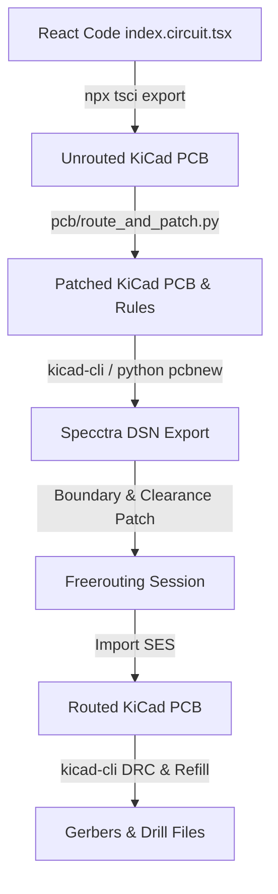

# PCB Design & Automated Routing Pipeline

This document explains the architecture of the Atari 7800 YM2149 sound card cartridge PCB, how the automated compilation and routing pipeline works, and the design decisions made to work around current `tscircuit` limitations.

---

## PCB Overview
The board is a **2-layer cartridge PCB** currently in the **experimental prototype phase (not production-ready)**. The project is still in its early stages, and the PCB has not yet been ordered for physical fabrication. While it interfaces the Atari 7800's expansion port to a YM2149 sound chip, address decoding logic, and audio pre-amplifier, mechanical verification and adjustments to fit standard cartridge shells remain a work-in-progress.

### Hardware Stack:
* **J1 (Atari 7800 Edge Connector)**: Custom edge connector card geometry.
* **U1 (27C256 ROM)**: Cartridge program storage.
* **U2 (ATF16V8B GAL)**: Address decoding logic.
* **U3 (74HCT373 Latch)**: Demultiplexes/latches the multiplexed data/address bus.
* **U4 (YM2149 Sound Chip)**: Synthesizes 3-channel audio.
* **U5 (LM358 Op-Amp)**: Active summing amplifier and output buffer.

---

## Compilation & Routing Pipeline
Because we maintain a code-first design, the single source of truth is `pcb/index.circuit.tsx`. Generating the final routed KiCad project and manufacturing-ready Gerber/Drill files is fully automated via the `make pcb` task. 

To keep the pipeline robust, we interface directly with the **official KiCad Python API (`pcbnew`) and native `kicad-cli` commands** wherever possible rather than relying on custom text parsers.

The build runner (`pcb/route_and_patch.py`) executes the following sequential steps:

### Pipeline Steps:
1. **Export**: Compiles the React TSX file into a fully defined schematic and physical footprint layout on the board, but without any copper trace routing (an unrouted KiCad board, `.kicad_pcb`).
2. **Patching Design Settings (`route_and_patch.py`)**:
   * **Stubs**: Cleans up dummy `tscircuit:Unknown` footprint stubs.
   * **Silkscreen**: Standardizes reference designator text dimensions (height/width $\ge 0.8\text{mm}$, thickness $\ge 0.1\text{mm}$) to satisfy manufacturing silkscreen rules.
   * **DRC Severity**: Disables cosmetic warnings (e.g., missing footprints from libraries, text size out of range) in the project settings (`.kicad_pro`).
   * **Zone Filling**: Sets GND zones to always remove isolated copper islands (`SetIslandRemovalMode(0)`) and decreases zone `min_thickness` to `0.15mm` so GND copper pours can flow through the tight right-shoulder boundaries.
   * **Custom Rules (`.kicad_dru`)**: Writes custom KiCad design rules to waive edge clearances for the card-edge connector `J1` and allow tight VCC/GND/signals to escape through the narrow connector notches.
3. **DSN Export**: Exports the board into Specctra DSN format using the `pcbnew` Python API.
4. **DSN Patching**:
   * Modifies clearance rules inside the DSN file so Freerouting handles the SMD edge pads correctly.
   * Pads the bottom DSN boundary coordinate to `-140.2mm` (instead of `-140.0mm`). This provides the minimum `0.2mm` clearance Freerouting needs to route the edge pins flush to the physical board edge without failing.
5. **Freerouting**: Launches the Freerouting CLI to automatically route all signals.
6. **Import**: Imports the generated Specctra SES route session back into the `.kicad_pcb` board.
7. **DRC & Zone Refill**: Refills all copper zones and executes `kicad-cli` Design Rule Checking.
8. **Export Gerbers**: Outputs production-ready plot files to `pcb/gerbers/`.

---

## Workarounds for Current `tscircuit` Limitations

> **_NOTE:_**
> We pushed `tscircuit` as far as we could to solve these layout and DRC issues natively, but it's entirely possible we missed a cleaner setting, flag, or feature in the framework. Regardless of whether a native solution exists, this pipeline is how we successfully resolved the issues and got the board layout and routing fully working.

Maintaining a complex 2-layer cartridge design pushes some boundaries of `tscircuit`. Admittedly, our current build pipeline is a bit "hacky" as it relies on automated post-export scripts to patch geometry and project rules to make things compile cleanly:

### Routing Offloading (`routingDisabled={true}`)
* **Limitation**: `tscircuit`'s built-in autorouter is currently optimized for simple, single-sided or multi-layer boards without tight mechanical constraints.
* **Workaround**: We set `routingDisabled={true}` on the `<board>` and offload the complete routing workload to `Freerouting` via the DSN/SES loop.

### Board Boundary Clearance Violations
* **Limitation**: Cartridge edge connector pads must touch the board outline bottom boundary. Standard DRC rules mandate a minimum copper-to-edge clearance (usually $0.3\text{mm}$ to $0.5\text{mm}$), causing autorouters to leave edge pins unrouted.
* **Workaround**: We patch the Specctra DSN boundary to `-140.2mm` and utilize KiCad's custom Design Rules (`.kicad_dru`) to whitelist edge-clearance violations specifically for the edge connector `J1`.

### Zone Isolation and Continuity
* **Limitation**: The narrow board notches split the top and bottom copper planes, creating isolated regions (islands) on the right shoulder of the board.
* **Workaround**: We programmatically modify the zone properties using the Python `pcbnew` API to enforce `island_removal_mode = 0` (always remove unconnected copper islands) and reduce `min_thickness` to `0.15mm`. This allows copper planes to flow continuously through tight passages, maintaining ground plane integrity.

---

The ultimate goal of this project's layout pipeline is to **completely eliminate the need for external post-export scripts** (such as `pcb/route_and_patch.py`) and perform all design rule configurations, footprint cleanup, and routing directly inside `tscircuit`. 

Currently, KiCad is only used as a final post-processing tool to get the design over the finish line (for routing and DRC/Gerber generation). As `tscircuit` matures, we expect to be fully native within the `tscircuit` environment for the entire design and fabrication lifecycle.

However, if physical layout and routing constraints become too complex to declare programmatically, the project may pivot to **designing the PCB layout directly in KiCad**, while maintaining the **schematic design in tscircuit** as the source of truth for component connections and code-first schematics.

As the framework and surrounding ecosystem mature, we hope to transition by:
1. **Adopting Native Autorouting**: Re-enabling `tscircuit`'s internal routing engine once it matures to handle complex double-sided routing and custom clearance constraints natively.
2. **Eliminating Python/CLI Wrappers**: Doing away with custom DSN boundary patches and KiCad Python API dependencies as soon as `tscircuit` exports clean, fully-compliant production-ready boards directly.
3. **Standardizing Footprints**: Migrating component models (e.g., standardizing SMD packages for bypass capacitors) within `tscircuit` itself to reduce overlaps and physical design rule warnings out-of-the-box.

---

## Collaboration: Getting By "With a Little Help from My Friends" (AI)

Marrying code-first React PCB declarations with custom low-level python scripts is a *Long and Winding Road*, but we managed to *get by with a little help from my friends* (in this case, the AI assistant). 

This joint effort was primarily focused on developing and refining the `pcb/route_and_patch.py` pipeline, where the AI played a vital role in:
* **Debugging tscircuit's internal structure** to successfully port custom plated-hole via definitions.
* **Diagnosing Freerouting boundary clearance math** and finding the exact coordinate offset hacks needed to place edge pins flush with the card boundary.
* **Automating pythonic patches** to KiCad's project settings and zone priorities to eliminate design rule violations headless.

This project is a testament to how pair programming with AI tools can accelerate hardware prototyping workflows from start to end.

---

## Open Source: "Help! I Need Someone..."

This project is completely open source. Because the design is in its early stages and hasn't been ordered for physical fabrication yet, community feedback and contributions are highly welcome. This is my first PCB design—and I picked a doozy!

*"Help! I need someone... not just anybody... you know I need someone!"* as the Beatles said, so any assistance is greatly appreciated!
