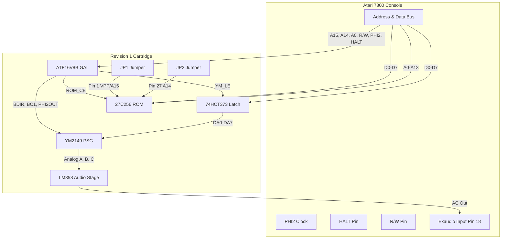

# Rev 1 PCB Theory of Operation & Assembly Guide

This document explains the architecture, signal flow, memory mapping, and jumper configurations for the **Lokey 7800 YM Revision 1 PCB**. Use this as a reference for assembling, programming, and debugging your boards.

---

## 1. System Architecture

The Lokey 7800 YM bridges the Atari 7800 console's expansion bus with a YM2149 Sound Generator (PSG) and a game EPROM (up to 32KB playable space).

---

## 2. Address Decoding & Memory Map

The GAL (`U2` - ATF16V8B) acts as the address decoder, monitoring address lines `A15` and `A14` to divide the memory map:

* **Cartridge ROM Space ($8000–$FFFF)**:
  * When `A15 = 1`, the GAL asserts `/ROM_CE` (Pin 19) to `LOW`, enabling the EPROM (`U1`). 
  * The ROM drives the data bus (`D0–D7`) to return game instructions.
* **Sound Card Register Space ($4000–$7FFF)**:
  * classic games (like *Ballblazer* and *Commando*) mapped their audio chips to `$4000`. 
  * The GAL asserts YM2149 control signals when `A15 = 0` and `A14 = 1` during write cycles (`R/W = 0`).

---

## 3. Data & Address Multiplexing (74HCT373)

The YM2149 uses a multiplexed address/data bus (`DA0–DA7`), while the Atari 7800 separates them. 

* The **74HCT373 Octal Latch (`U3`)** bridges this gap:
  * When the CPU writes to the sound registers, the GAL asserts `YM_LE` (Latch Enable) `HIGH`.
  * This stores the current data bus value (`D0–D7`) in the latch.
  * The latch outputs (`Q0–Q7`) drive the YM2149's multiplexed pins (`DA0–DA7`), holding the address or data stable for the PSG.

---

## 4. Hardware Reset & Warm Start Fix

A common issue with retro PSG cartridges is a high-frequency stuck hum on system reset or quick power-cycle ("Warm Start"). 

* The **RC Reset Delay network (`RRESET1` and `CRESET1`)** solves this:
  * At power-on, the empty `10µF` capacitor pulls `/RESET` to `GND`.
  * The capacitor charges slowly through the `10kΩ` pull-up resistor.
  * This keeps `/RESET` low for a few milliseconds after the +5V rail stabilizes, giving the console time to run its BIOS and silence the audio channels.

---

## 5. Active-Passive Hybrid Audio Stage

The audio outputs of the YM2149 channels A, B, and C are mixed and buffered using an **LM358 Op-Amp (`U5`)**:

1. **Mixing**: Channels A, B, and C are summed through three **1kΩ isolation resistors** into a single summing node (`net.SUM_NODE`).
2. **Buffering & Saturation**: The summing node connects to the inverting input of the LM358 (`IN1_NEG`). A **1kΩ resistor** connects the output back to the input. This configuration prevents the output voltage from exceeding the single-supply limit, avoiding harsh console clipping.
3. **Class-A Bias**: A **1kΩ pull-down resistor** (`RPULL`) biases the op-amp output stage into Class-A operation to eliminate crossover distortion.
4. **AC Coupling**: A series **1kΩ resistor** and **10µF capacitor** remove DC offset and smooth out the PSG's high-frequency square wave transients before injecting the signal into the Atari's **External Audio Input (Exaudio Pin 18)**.

---

## 6. Solder Jumper Configurations

Before powering on the cartridge, bridge the solder jumpers `JP1` and `JP2` with solder to configure your ROM size:

| ROM size | Jumper `JP1` (Pin 1) | Jumper `JP2` (Pin 27) | Notes |
| :--- | :--- | :--- | :--- |
| **16 KB (27C128)** | **Bridge Left (VCC)** | **Bridge Left (VCC)** | Ties `!PGM` high. ROM mirrors in both halves of the $8000–$FFFF space. |
| **32 KB (27C256)** | **Bridge Left (VCC)** | **Bridge Right (A14)** | Standard 32KB configuration. |
| **64 KB (27C512)** | **Bridge Left (VCC)** | **Bridge Right (A14)** | Uses 64KB chips running a 32KB game. Mirror or burn game into the **upper half** (offset `$8000`). |
